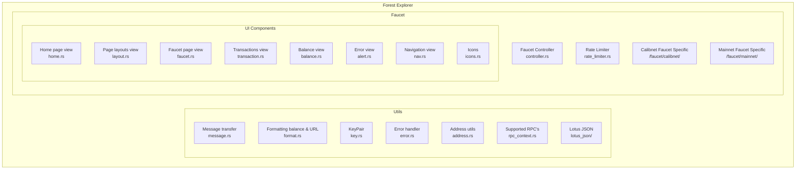

Forest Explorer Components Diagram

```mermaid
graph TD
    subgraph src["Forest Explorer"]
        subgraph utils["Utils"]
            message["Message transfer<br/>message.rs"]
            format["Formatting balance & URL<br/>format.rs"]
            key["KeyPair<br/>key.rs"]
            error["Error handler<br/>error.rs"]
            address["Address utils<br/>address.rs"]
            rpc_context["Supported RPC's<br/>rpc_context.rs"]
            lotus_json["Lotus JSON<br/>lotus_json/"]
        end
        subgraph faucet["Faucet"]
            model["Faucet Model<br/>model.rs"]
            model["Faucet Controller<br/>controller.rs"]
            rate_limiter["Rate Limiter<br/>rate_limiter.rs"]
            calibnet["Calibnet Faucet Specific<br/>/faucet/calibnet/"]
            mainnet["Mainnet Faucet Specific<br/>/faucet/mainnet/"]
            subgraph views["UI Components"]
                home["Home page view<br/>home.rs"]
                layout["Page layouts view<br/>layout.rs"]
                faucet_view["Faucet page view<br/>faucet.rs"]
                transaction["Transactions view<br/>transaction.rs"]
                balance["Balance view<br/>balance.rs"]
                alert["Error view<br/>alert.rs"]
                nav["Navigation view<br/>nav.rs"]
                icons["Icons<br/>icons.rs"]
            end
        end
    end
```
