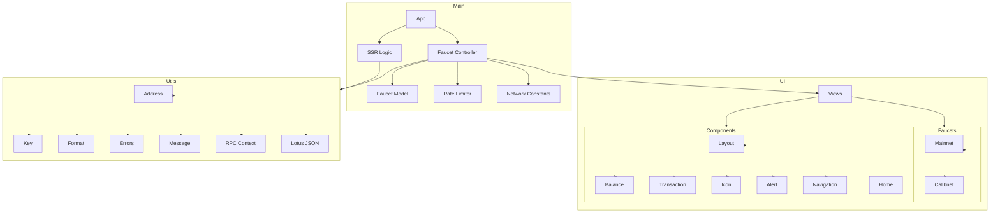

Forest Explorer Components Diagram

```mermaid
flowchart TD
  %% Forest Explorer Components
  subgraph Main
    direction TB
    App[App]
    Ctrl[Faucet Controller]
    Model[Faucet Model]
    Server[SSR Logic]
    RateLimiter[Rate Limiter]
    Constants[Network Constants]
  end

  %% UI
  subgraph UI
    direction TB
    Views[Views]
    Home[Home]
    Faucets[Faucets]
    Components[UI Components]
  end

  %% Sub-sections of UI
  subgraph Faucets
    direction TB
    Mainnet[Mainnet]
    Calibnet[Calibnet]
  end
  subgraph Components
    direction TB
    Layout[Layout]
    Balance[Balance]
    Transaction[Transaction]
    Icon[Icon]
    Alert[Alert]
    Nav[Navigation]
  end

  %% Utilities
  subgraph Utils
    direction TB
    Addr[Address]
    Key
    Fmt[Format]
    Err[Errors]
    Msg[Message]
    RpcCtx[RPC Context]
    LotusJson[Lotus JSON]
  end

  %% Main relations
  App --> Ctrl
  App --> Server
  Ctrl --> Model
  Ctrl --> RateLimiter
  Ctrl --> Constants
  Ctrl --> Utils
  Ctrl --> Views
  Server --> Utils

  %% UI relations
  Views --> Faucets
  Views --> Components

  %% UI sub-relations
  Faucets --> Mainnet
  Faucets --> Calibnet
  Components --> Layout
  Components --> Balance
  Components --> Transaction
  Components --> Icon
  Components --> Alert
  Components --> Nav

  %% Utilities relations
  Utils --> LotusJson
  Utils --> Addr
  Utils --> Key
  Utils --> Fmt
  Utils --> Err
  Utils --> Msg
  Utils --> RpcCtx
```
